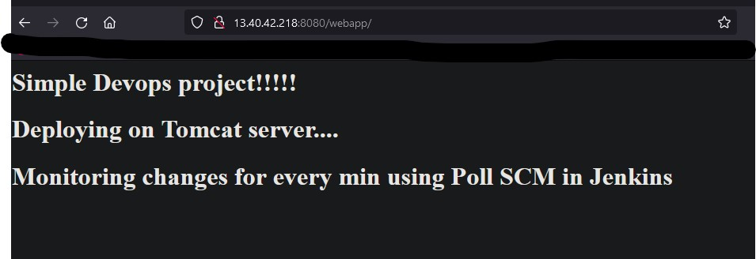

# Table of contents

- General Info
- Technologies
- Setup


## General Info

The purpose of this project is to deploy a simple WAR file on Tomcat server which runs on Docker conatiners using Continuous Integration and Continuous Deployment.
The source code to build the WAR file comes from Github, Jenkins pulls the code from Git and build the WAR file using MAVEN tools. After building the file, the artifact will be tested and pushed to remote server for deployment. On the remote server, we will have to write Dockerfile and Docker-compose file to run Tomcat server. Using a bash script, the copied artifact WAR file will be deploy onto Docker container where Tomcat server is running, this can be seen from web browser.


## Technologies

- Bash Scripting
- Github
- Maven
- Jenkins
- Docker

 
## Setup

As per the aim of this project, we need 2 VM instances, here we are using AWS EC2 instances,
1. Jenkins server
2. Remote server for deployment 

First thing, we need to install Jenkins for Continuous Integration and Continuous Deployment. To setup Jenkins please refer my Jenkins installation guide on [here](https://github.com/nav-InverseInfinity/Jenkins-setup)
similarly, we will need Maven to build a WAR file from Github source code.

### Maven setup 

```sh
 #goto https://maven.apache.org/download.cgi

 cd /opt

 sudo wget https://dlcdn.apache.org/maven/maven-3/3.8.5/binaries/apache-maven-3.8.5-bin.tar.gz

 #Extract tar 
 sudo mkdir maven && sudo tar -xvzf apache-maven-3.8.5-bin.tar.gz -C maven
```
### For maven we need to set up PATH for two varibales M2_HOME & M2. M2_HOME should refer to /opt/maven and M2 should refer to /opt/maven/bin
### In order to do that goto .profile on Ubuntu distro add & update the PATH
```sh
vi ~/.profile 
#add these lines

M2=/opt/maven/bin
M2_HOME=/opt/maven

#update PATH
PATH=$PATH:$M2:$M2_HOME

#save the file

```
### Next we will have to setup Maven in Jenkins interface as well 
- install "Maven Invoker" plugin 
- goto "Manage Jenkins" --> Global Tool Configuration --> Add Maven Installation
- Under Name "M2_HOME" and Maven Home is the path /opt/maven

	


### Next we will have to install Docker on remote server and write Dockerfile to run tomcat server.
##### To install docker and docker compose please refer my guide [here](https://github.com/nav-InverseInfinity/docker-setup)
##### After installation, we will have to write Dockerfile to build docker image based on the apache tomcat server and write docker-compose yaml file to initiate docker container.

- ### *Dockerfile -please refer to my Dockerfile* [here](https://github.com/nav-InverseInfinity/Jenkins-tomcat-deployment/blob/main/Dockerfile) 	
	
 #### Base from tomcat server, however the latest version have two directories *"webapps"* & "webapps.dist", by deafult tomcat run files from "webapps", but in the latest version default files are loacted in "webapps.dist", so we will have to move the files from "webapps.dist" to "webapps"


- ### *Docker-compose.yml file - please refer* [here](https://github.com/nav-InverseInfinity/Jenkins-tomcat-deployment/blob/main/docker-compose.yml)
 ##### Docker-compose files helps to build the docker image from Dockerfile. 

- ### *Bash script for deployment - please refer* [here](https://github.com/nav-InverseInfinity/Jenkins-tomcat-deployment/blob/main/deploy.sh)
 ##### This script will build the Docker image from docker-compose.yml and copy the artifact WAR file to Docker tomcat image.


#### In order to automate the whole CI/CD environment, we will have to establish the connections between servers  Since we are going to connect to our remote server, we will have to install “**SSH-Agent**” plugin and make the connection, please refer my guide to Jenkins connections [repo](https://github.com/nav-InverseInfinity/Jenkins-setup)


## Process - CI/CD Pipeline

Plan is to build Jenkins CI/CD pipeline with environmental variables, here we are going to pass the AWS IP as “**secret text**”, AWS IP = **AWS_IP**
Since we are going to build WAR file from JAVA source code, we will need "tools" - here "maven"
```sh
 tools {
        maven "M2_HOME"
    }
``` 

### CI/CD Stages refer [here](https://github.com/nav-InverseInfinity/Jenkins-tomcat-deployment/blob/main/Jenkins_pipeline)


- #### *Build* - pull the source code (simple java code) from GitHub and build a WAR file aritifacta and then test it.
```sh
	git branch: 'main', url: 'https://github.com/InverseInfinity/tomcat_test.git'
	sh "mvn -Dmaven.test.failure.ignore=true clean package"
```
- #### *Push* - After building and testing the artifact, we will have to copy the *.WAR file to remote server for deployment.

```sh
	scp /var/lib/jenkins/workspace/tomcat_pipline/webapp/target/*.war ec2-user@$AWS_IP:~/
```	
- #### *Deploy* - With the help of "deploy.sh" deployment bash script which will build the Docker image from docker-compose.yml and copy the artifact WAR file to Docker tomcat image.

```sh
   ssh ec2-user@$AWS_IP "cd /home/ec2-user && /home/ec2-user/deploy.sh"
```

Since we need to automate the process, that is whenever there is a change in the source code, Jenkins should trigger and run the pipeline, so we can see the change on the deployment. 
### To do this, we will have to activate Jenkins Poll SCM, which will monitor for any changes in the source code, if there is any change occurs, Jenkins deployment job will be triggered and start to deploy the new changes, this way it can be completely automated.



